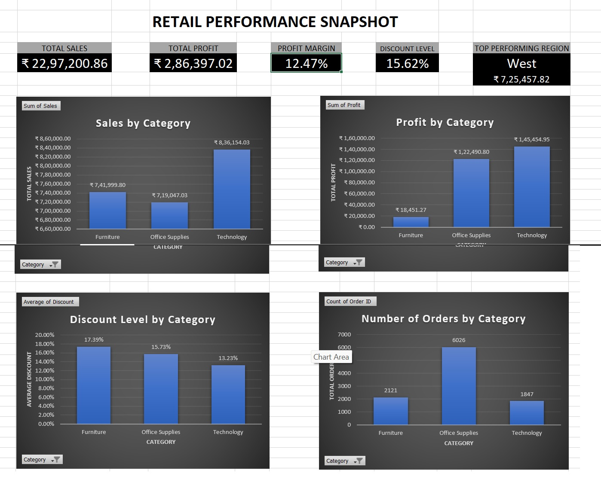

# 🛒 Retail Performance Snapshot - Superstore Analysis

A comprehensive Excel dashboard designed to analyze retail performance across different product categories and geographical regions.

## 📌 Project Overview
This project transforms raw transactional data from the "Superstore" dataset into an interactive visual summary. The dashboard provides key insights into sales trends, profitability, and operational efficiency to support data-driven decision-making.

## 🚀 Key Features
- **High-Level KPIs:** Instant visibility into Total Sales (₹22.97L), Total Profit (₹2.86L), and overall Profit Margin (12.47%).
- **Category Analysis:** Comparative breakdown of Sales and Profit by Category (Furniture, Office Supplies, Technology).
- **Efficiency Metrics:** Visualization of average discount levels (15.62% overall) to monitor promotional impact.
- **Order Volume:** Tracking total order counts, highlighting Office Supplies as the high-volume leader (6,026 orders).
- **Regional Spotlight:** Identification of the top-performing region (**West** with ₹7.25L in sales).

## 🛠️ Tools Used
- **Microsoft Excel:** Pivot Tables, Data Modeling, and Charting.
- **Data Visualization:** Clustered Bar Charts, KPI Scorecards, and Dashboard Design.

## 📊 Dashboard Preview

## 💡 Key Insights
1. **Technology Dominates:** Technology is the most profitable category (₹1.45L), followed closely by Office Supplies.
2. **The "Furniture" Gap:** Despite having the second-highest sales volume, Furniture has the lowest profit (₹18.4K) due to the highest average discount rate (17.39%).
3. **Volume vs. Value:** Office Supplies drive the highest number of orders (6,026), but Technology generates more revenue per sale.
