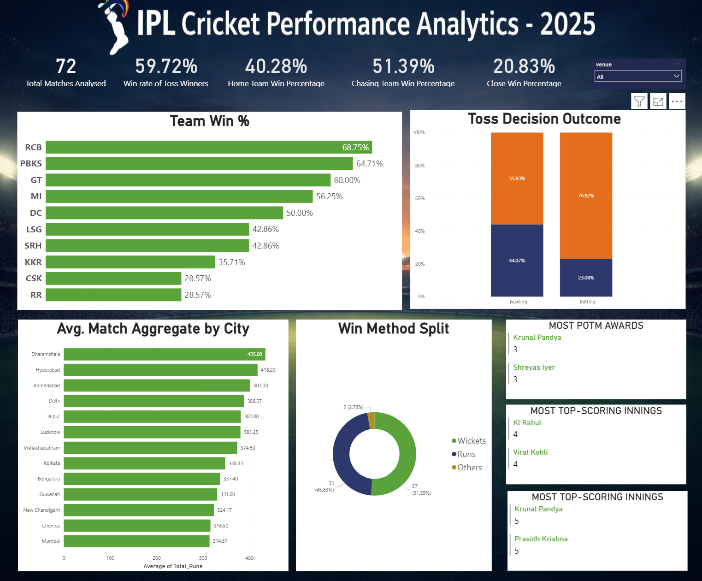

# 🏏 IPL 2025 Performance Analytics Dashboard

[cite_start]An end-to-end data analysis project focused on uncovering strategic insights from the IPL 2025 season to support data-driven decision-making for teams and stakeholders[cite: 2].

## 📌 Project Overview
[cite_start]This project analyzes a comprehensive dataset of 72 matches from the 2025 season. [cite_start]By tracking tactical choices, venue characteristics, and player impacts, the dashboard identifies the core drivers of success in the world's most competitive T20 league[cite: 9, 10].

## 🚀 Key Insights & KPIs
- [cite_start]**Toss Advantage:** Winning the coin toss provides a measurable advantage, resulting in a match win nearly **60% of the time**[cite: 12].
- [cite_start]**Chasing Dominance:** While batting first shows a high percentage in limited games, a 60-game sample confirms **bowling first** as the more reliable strategy (55% win rate)[cite: 17].
- [cite_start]**Venue Volatility:** Scoring varies significantly by city, with **Dharamshala** leading as the highest-scoring venue (Avg. 435 runs aggregate) and **Mumbai** being more competitive (Avg. 314 runs).
- [cite_start]**Home Ground Myth:** Data reveals that playing at a home ground was **not a major advantage** this season, with a home team win percentage of only 40.28%[cite: 13].

## 🛠️ Strategic Recommendations
1. **Prioritize Chasing:** Teams should maintain "bowl first" as the default tactical call, except at extreme high-scoring venues like Dharamshala or Hyderabad.
2. **Venue-Specific Playbooks:** Strategies must be ground-specific; prioritize big-hitting at high-aggregate venues and spin/technical rotation at lower-scoring grounds like Chennai.
3. **All-rounder Investment:** High-impact players who contribute with both bat and ball (e.g., Krunal Pandya) appear disproportionately in winning team profiles.

## 📊 Dashboard Preview
*(Tip: Take a screenshot of your Power BI dashboard and replace the placeholder below!)*

## 📁 Repository Structure
- `IPL2025_Dashboard.pbix`: The interactive Power BI dashboard file.
- [cite_start]`IPL2025_Presentation_Final.pptx`: Executive summary and strategic recommendations.
- `Data/`: Folder containing the cleaned CSV datasets used for analysis.

## 🛠️ Tools Used
- **Power BI:** Data visualization and KPI tracking.
- **Power Query:** Data cleaning and transformation.
- [cite_start]**Microsoft PowerPoint:** Stakeholder presentation and reporting.
